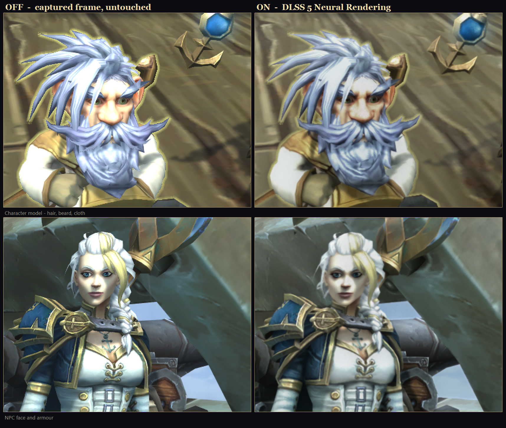
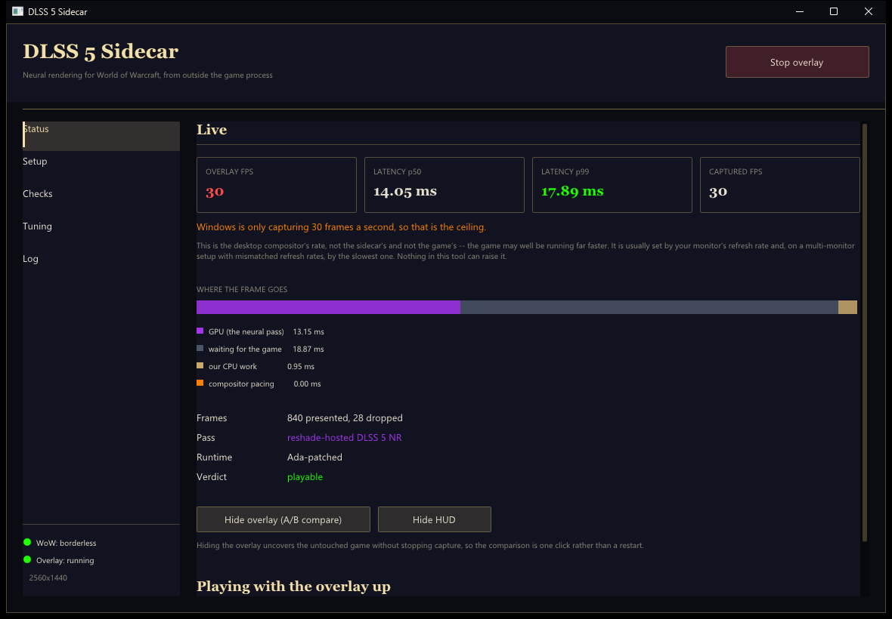
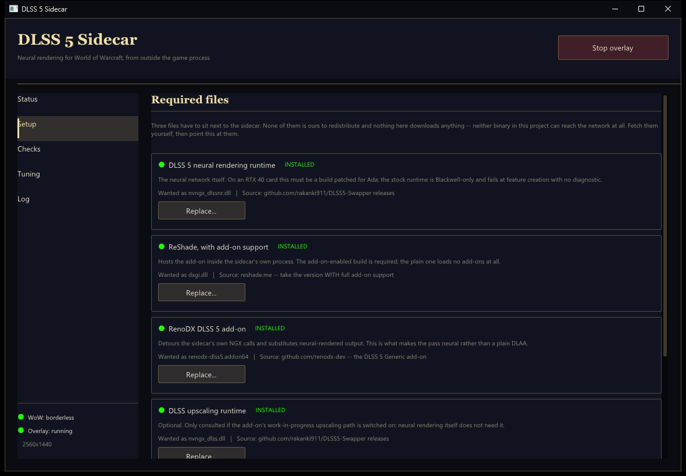
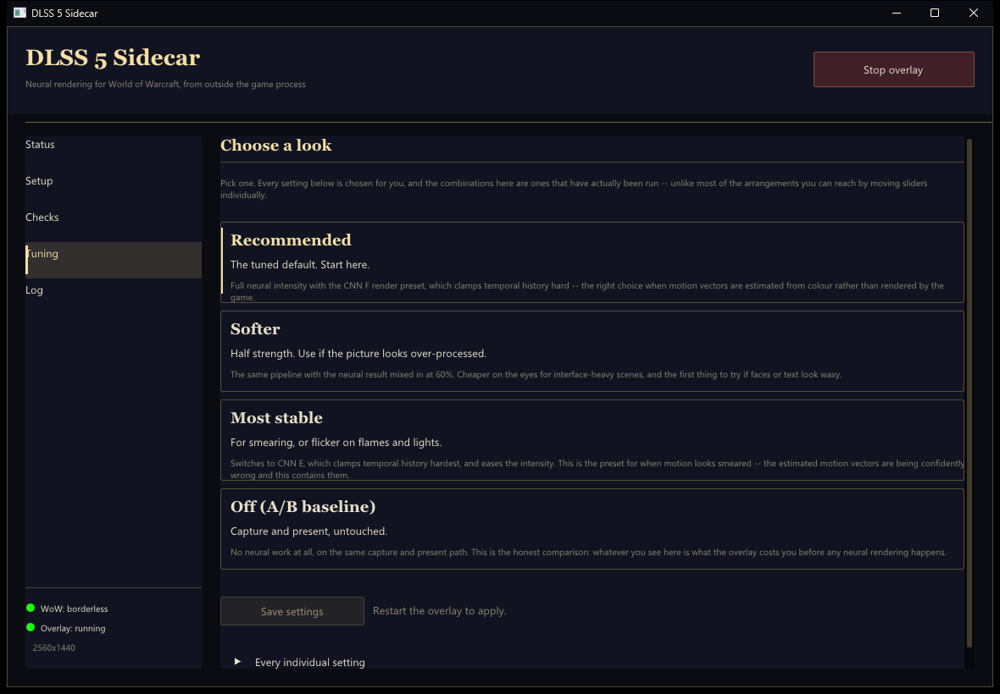

# DLSS 5 Sidecar for World of Warcraft

Runs NVIDIA's DLSS 5 Neural Rendering over a live World of Warcraft frame —
**without loading a single byte of code into `Wow.exe`**.

The game is captured out of the Windows compositor, processed in a separate
process, and the result is presented back over the top through an opaque
click-through overlay. WoW never sees this program. There is no injector, no
detour, no hook, no memory read, and nothing placed in the game's folder.

Measured on an RTX 4080 at 2560×1440 against retail WoW: **p50 11.6 ms, p99
12.6 ms** capture-to-present, with neural rendering armed.

> **Status: working, and rough.** Neural rendering runs on real frames on Ada
> hardware. What it costs in image quality, and whether it is worth the latency
> on your setup, is a judgement you make with the game in front of you — the
> manager ships a one-click A/B against the untouched frame so you can.

## What it actually looks like



Retail WoW, RTX 4080, 2560×1440, shown at 2×. The overlay was toggled between
two captures a third of a second apart with the character parked, so the halves
line up.

Neural rendering smooths the hair and beard strands, softens the hard aliased
outline around the model, and evens out the cloth. It also **darkens the image
and flattens facial contrast** — look at the NPC's eyes and skin. That is a real
side effect, not a compression artefact in this screenshot, and whether it is a
fair trade is a matter of taste rather than something a README can settle.

**It is presented at 2× zoom for a reason.** At 1:1, in motion, the effect is
subtle. Judge it with the one-click A/B in the app rather than from a picture;
full frames are in [`docs/screenshots/`](docs/screenshots/) as `dlss-on.jpg`
and `dlss-off.jpg`.



**Read the frame-rate section before you install this.** The honest headline is
that the overlay is capped by how fast Windows hands out captured frames, and on
the machine this was developed against that is 60 per second regardless of the
239 Hz monitor behind it. The app measures and shows you this directly.

---

## Why this exists, and why it is shaped like this

The obvious way to get DLSS 5 into a game that does not support it is to inject
a DLL beside the executable. For World of Warcraft that is not a trade-off, it
is a mistake: Blizzard bans accounts for ReShade next to `Wow.exe`, and no
amount of care on the tool's part changes that.

So this project does the harder thing. It never touches the game process at all.
Everything happens out-of-process, on a frame that Windows has already finished
compositing.

That constraint is not a comment in a design document — it is enforced against
the built binaries on every build and in CI:

| Invariant | What it forbids | How it is checked |
|---|---|---|
| I1 | Reading or writing another process's memory | Import table scan |
| I4 | Window hooks of any kind (`SetWindowsHookEx`) | Import table scan |
| I6 | Synthesising input (`SendInput`, `keybd_event`, …) | Import table scan |
| I10 | Networking, of any kind, in either binary | Import table scan |
| I12 | Requesting elevation | Manifest scan |
| I7/I8/I9 | Installing next to `Wow.exe`, or running with an injector present | Unit-tested predicates |

`ci/check_imports.py` reads the import directory — static *and* delayed — of
every executable produced and fails the build if any forbidden symbol appears.
The claim is checked, not asserted.

**This is not a guarantee you will never be banned.** No third-party tool can
offer that. What it is: this program does not do the things people get banned
for.

---

## What you need

| | |
|---|---|
| **GPU** | NVIDIA RTX 40 (Ada) or RTX 50 (Blackwell). Nothing else is supported, and the manager will say so. |
| **OS** | Windows 11 |
| **WoW** | Running in **borderless windowed** mode. Exclusive fullscreen has no compositor surface to capture. |
| **Resolution** | Up to 1440p on Ada, up to 2160p on Blackwell, is what the GPU matrix intends. Above that it still runs, and tells you it will cost more. |

### Three files you must supply yourself

None of these is ours to redistribute, and **neither binary in this project can
reach the network at all** — nothing here downloads, updates, or phones home.
The manager's **Setup** tab tells you exactly what is missing, what it is for,
and where it comes from; you fetch it, and point the manager at the file.

| File | What it is | Where |
|---|---|---|
| `nvngx_dlssnr.dll` | The DLSS 5 neural rendering runtime. **On RTX 40 this must be an Ada-patched build** — the stock runtime is Blackwell-only and fails at feature creation with no diagnostic. | [DLSS5-Swapper](https://github.com/rakanki911/DLSS5-Swapper/releases) |
| `dxgi.dll` | ReShade, **the build with full add-on support**. | [reshade.me](https://reshade.me) |
| `renodx-dlss5.addon64` | The RenoDX DLSS 5 add-on. | [renodx-dev](https://github.com/renodx-dev) |

All three go next to `wowsidecar.exe`. **Never next to `Wow.exe`** — the manager
refuses that arrangement and the check is unit-tested.

---

## Using it

1. Run `wowsidecar-manager.exe`.
2. **Setup** — install the three files above. Each row says whether it is
   present and what it is for.
3. **Checks** — everything should be green. A failing check always comes with a
   remedy; a warning is a judgement call left to you.
4. Start WoW in borderless windowed mode.
5. **Start overlay.** The manager minimises itself and the overlay comes up.



**You play normally.** The overlay covers the game completely but passes every
click straight through to it and never takes focus. If the keyboard stops
reaching the game, alt-tab to WoW once.

**Ctrl+Alt+Backspace** takes the overlay down from anywhere, without needing the
manager window — it is a panic switch, and it works even if the manager is gone.

### Tuning



Pick a preset. There are four, they are the combinations that have actually been
run, and the good one is the default:

| Preset | For |
|---|---|
| **Recommended** | The tuned default. Full intensity, CNN F, flow grid 4. Start here. |
| **Softer** | Half intensity. If the picture looks over-processed, or faces and text look waxy. |
| **Most stable** | CNN E and a finer motion grid. For smearing, or flicker on flames and lights. |
| **Off (A/B baseline)** | No neural work, same capture and present path. What the overlay costs you before any neural rendering. |

Every individual slider is still there under **Every individual setting**, but
nothing in there is needed for normal use — and two of them cost real frames:
**optical flow grid 1** is sixteen times the motion-vector work of grid 4, and
the add-on's **upscaling** toggle is a work-in-progress path that reports
falling back to native anyway. The presets set both correctly.

Settings land in `sidecar.toml` and are projected into the `[RenoDX.DLSS5]`
section of `ReShade.ini`. The add-on reads that file once, when it loads, so **a
change takes effect at the overlay's next start**, not while it runs.

---

## About frame rate

This is the part most people will care about, so here are the measurements
rather than a claim. All on an RTX 4080, 2560×1440, against retail WoW.

**There is a hard ceiling, and it is not the neural pass.** Windows Graphics
Capture delivers frames at the desktop compositor's rate. On the development
machine that is **60 per second**, on a 239 Hz monitor, with the game itself
running far faster. Nothing in this tool can present a frame that was never
captured, so 60 is the ceiling — and the Status page shows **CAPTURED FPS**
beside **OVERLAY FPS** so you can see immediately which one is limiting you.

If they are equal, you are capture-bound and no setting will help. It is worth
checking whether a multi-monitor setup with mismatched refresh rates is dragging
the compositor down to the slowest display.

### Video memory is the thing that will actually ruin it

Watch the **GPU MEMORY** bar on the Status page before you blame the neural
pass. This is the failure that does not look like itself.

Past the per-process budget the driver evicts resources to system memory and
every frame waits on the PCIe bus. Frame times explode while the GPU sits
*nearly idle* — on the development machine, measured within a single session:

| GPU memory state | overlay | GPU wait |
|---|---|---|
| comfortable | 40 fps | 24 ms |
| card ~91% full, 745 MB spilled to system RAM | **6.5 fps** | **153 ms** |

Same build, same settings, same scene. Nothing about the pipeline changed. A
process-level GPU utilisation counter showed the sidecar at *8.8%* while it was
taking 153 ms a frame, which is the tell: that time is not compute.

The card's memory is shared with everything else on the desktop, and the
sidecar is rarely the biggest consumer — on the development machine the desktop
compositor alone held 9.1 GB of 16. Close browsers, streaming and capture tools,
and anything compositing a second monitor; lower the game's texture quality.
**Nothing in this tool can make room**, which is exactly why it tells you.

**Underneath that ceiling, two things were worth fixing:**

| | before | after |
|---|---|---|
| Swapchain (2 buffers / latency 1 → 3 / 2) — p50 | 14.16 ms | **11.61 ms** |
| the same, p99 | 16.86 ms | **12.55 ms** |
| Default settings → Recommended preset, presented | 52.0 fps | **59.9 fps** |
| the same, GPU time | 18.1 ms | **13.1 ms** |

The first was a self-inflicted stall: with two buffers and a maximum frame
latency of one, presents blocked on the compositor *inside* our own fence wait,
where it looked exactly like GPU work.

**And one thing that turned out not to be a lever at all.** Asking DLSS for a
smaller render size does nothing here — measured at a 0.667 render scale, GPU
time moved from 10.7–11.1 ms to 10.4–10.9 ms, which is noise. The add-on
substitutes its neural output at *output* resolution, so the render size never
reaches the work that costs. **There is no DLSS upscaling on this route, and
therefore no performance win**: what you get is the neural rendering filter at a
fixed cost set by your capture resolution. It makes the picture different. It
does not make the game faster.

---

## How it works

```
WoW window ──> Windows Graphics Capture ──> D3D11→D3D12 shared texture
                                                      │
                       ┌──────────────────────────────┤
                       │                              │
              BGRA8 → R8 luminance            BGRA8 → RGBA16F
                       │                              │
                  NVIDIA NVOFA                        │
                (optical flow)                        │
                       │                              │
              flow grid → RG16F motion vectors        │
                       │                              │
                       └──────────> DLSS/DLAA evaluate <─── synthetic R32F depth
                                            │
                              (RenoDX add-on detours this call
                               and substitutes neural output)
                                            │
                                    UI mask blend
                                            │
                         DirectComposition overlay ──> screen
```

The counter-intuitive part is the neural pass. **It is a DLSS client, not a
neural-rendering client.** Asking NGX for a neural-rendering feature directly
does not work — the runtime refuses a session set up by anyone but the NGX core,
which two spikes established. So the sidecar creates and evaluates an ordinary
DLSS/DLAA feature, and the RenoDX add-on — loaded by ReShade into *our* process,
never the game's — detours our own NGX calls and substitutes neural-rendered
output.

Design and spike write-ups live in [`docs/`](docs/).

---

## Limitations, stated plainly

- **There is no depth buffer, and there cannot be one.** This captures DWM's
  composited output. There is no depth, no albedo, no normals, no camera
  matrices — one colour image and a motion field estimated from two of them. A
  constant depth plane is bound because the contract requires the binding. It
  costs temporal stability under motion rather than preventing NR from running.
- **Motion vectors are estimated, not rendered.** NVOFA infers them from
  luminance. They are good, not authoritative, and the CNN presets exist in the
  UI specifically to contain the cases where they are confidently wrong.
- **The contract is strictly weaker than any in-process tool's.** That is the
  price of not touching the game.
- **SDR only** today. The HDR knobs are carried through to the add-on but the
  capture path is SDR.
- **This costs frames; it does not gain them.** See *About frame rate* above:
  there is no upscaling lever on this route, and the capture rate caps the
  overlay well below what the game itself achieves.
- **Latency is real.** ~11.6 ms p50 on a 4080 at 1440p. Fine for questing and
  raiding; you will feel it in high-end PvP. The manager's Status tab breaks
  each frame into GPU, idle, CPU and compositor time so you can see where it
  goes rather than guess.
- **UI masking exists but has no calibration UI** — rectangles are hand-written
  into `sidecar.toml` for now.
- **The add-on's upscaling path is unfinished** and usually reports falling back
  to native. Off is the tested path.

---

## Building

```bash
cmake -S . -B build -G "Visual Studio 17 2022" -A x64
cmake --build build --config Release
```

Two optional SDKs, neither vendored (I11), both manual downloads:

| | |
|---|---|
| `-DDLSS_SDK_DIR=` | [NVIDIA/DLSS](https://github.com/NVIDIA/DLSS). Without it `NgxSession` compiles to a stub that reports why it is unavailable, and the neural pass falls back to passthrough. |
| `-DNVOF_SDK_DIR=` | NVIDIA Optical Flow SDK, headers only. Without it the pipeline runs on a zero motion field. |

Tests: `build\tests\Release\sidecar_tests.exe "[unit]"`. The `[device]` tests
need a real NVIDIA GPU and are excluded from CI, because a skipped GPU test must
not read as a pass.

---

## Prior art

This project would not exist without work that got there first:

- **[DLSS5-Feeder](https://github.com/jlrouzies-fr/DLSS5-Feeder)** — the closest
  prior art. It synthesises the DLAA contract from ReShade's depth buffer *inside*
  the game process. This project relocates that idea to the outside, and pays for
  it in the depth buffer it can no longer see.
- **[RenoDX](https://github.com/renodx-dev)** — the DLSS 5 add-on that makes
  route B possible at all.
- **[DLSS5-Swapper](https://github.com/rakanki911/DLSS5-Swapper)** — the
  Ada-patched runtime.
- **[dlss5-d3d12-fix](https://github.com/NIGos/dlss5-d3d12-fix)** and
  **[dlss5-dx11-bridge](https://github.com/NIGos/dlss5-dx11-bridge)**.

## License

See [LICENSE](LICENSE). The three files you supply yourself are covered by their
own licences, are never redistributed here, and `.gitignore` blocks them from
ever being committed.
