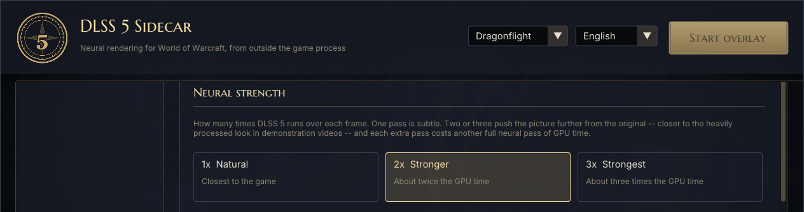
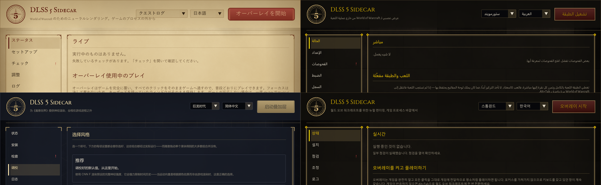

**English** | [Русский](README.ru.md) · [Website](https://xilla420.github.io/dlss5-wow-sidecar/) · [Changelog](CHANGELOG.md) · [How it works](docs/HOW-IT-WORKS.md)

# DLSS 5 Sidecar for World of Warcraft

**NVIDIA DLSS 5 Neural Rendering for World of Warcraft, without touching the game.**
A free overlay for RTX 40 and RTX 50 cards. Nothing is injected into `Wow.exe`,
and nothing goes in your WoW folder.

*Left: the game as it is. Right: with DLSS 5. Retail WoW, RTX 4080, 1440p, zoomed 2.4×.*
**[Drag the before/after slider on the website →](https://xilla420.github.io/dlss5-wow-sidecar/#compare)**

---

## Get started

1. **[Download the latest release](https://github.com/xilla420/dlss5-wow-sidecar/releases/latest)** and unzip it anywhere *except* your WoW folder.
2. Run **`wowsidecar-manager.exe`**.
3. Start WoW in **borderless windowed** mode.
4. Press **Start overlay** (or **Ctrl+Alt+S**). Then just play.

Everything you need is in the zip. The **Checks** page tells you if something is
wrong, and how to fix it.

**You need:** Windows 11 · an NVIDIA **RTX 40** or **RTX 50** card · WoW in borderless windowed mode.

## Hotkeys

| Keys | What it does |
|---|---|
| **Ctrl+Alt+S** | Start or stop the overlay |
| **Ctrl+Alt+D** | Show or hide the overlay: instant before/after |
| **Ctrl+Alt+H** | Show or hide the frame-time HUD |
| **Ctrl+Alt+Backspace** | Panic button: take the overlay down, always |

You can change the first three on the **Tuning** page.

## Strength: 1×, 2× or 3×

DLSS 5 can run more than once on every frame. **1×** is subtle and closest to the
game. **2×** and **3×** push the picture further, closer to the heavily processed
look you see in demo videos. Each extra pass costs roughly one more pass of GPU time.

## Three looks, ten languages

| Stormwind | Quest log | Dragonflight |
|---|---|---|
|  |  |  |

Pick the theme and the language at the top of the window. The interface speaks
English, Русский, Español, Deutsch, Français, Türkçe, العربية, 简体中文, 日本語 and 한국어.

## Is it safe for my account?

Here is what it does *not* do, and every build checks it automatically:

- It never loads code into `Wow.exe`, and never reads or writes the game's memory.
- It puts nothing in your WoW folder, and refuses to run if it finds an injector there.
- No ReShade next to the game. That is the setup Blizzard bans for.
- No keyboard hooks, no fake input, no internet access.

It reads the finished picture from Windows, the same way OBS or Discord screen
share does. **No third-party tool can promise you will never be banned.** This one
simply doesn't do any of the things people get banned for.
[How that is enforced →](docs/HOW-IT-WORKS.md#why-this-exists-and-why-it-is-shaped-like-this)

## Good to know

- **It won't raise your FPS.** DLSS 5 Neural Rendering changes how the game *looks*.
  It isn't upscaling or frame generation, and it costs some GPU time.
- **Windows caps the overlay at your capture rate**, often 60 fps. The Status page
  shows you exactly where each millisecond goes.
- **Cap WoW's frame rate** (Max Foreground FPS) to about the captured rate. That
  frees the GPU for the neural pass, at no cost.
- **Low on video memory?** Close browsers and streaming tools, or lower texture quality.
  The app warns you when this happens.
- It adds about 11 ms of latency. That's fine for questing and raiding, and you
  may feel it in high-end PvP.

## FAQ

**Does it work with WoW Classic?** Yes. Any client in borderless windowed mode works.

**Is it an addon?** No. It's a separate Windows program that sits over the game window.

**Which GPUs?** GeForce RTX 40 (e.g. 4060–4090) and RTX 50 (e.g. 5060–5090). Older
cards, AMD and Intel can't run DLSS 5.

**Where are the technical details?** In [How it works](docs/HOW-IT-WORKS.md):
the safety checks, frame-rate measurements, the pipeline, and how to build it.

---

MIT licensed. The third-party runtimes in the release zip belong to their authors;
see [THIRD-PARTY-NOTICES.md](THIRD-PARTY-NOTICES.md). Not affiliated with NVIDIA or
Blizzard Entertainment.
