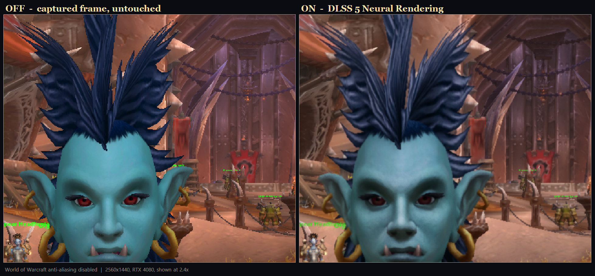

[English](README.md) | **Русский**

# DLSS 5 Sidecar для World of Warcraft

Выполняет нейронный рендеринг NVIDIA DLSS 5 поверх живого кадра World of
Warcraft — **не загружая в `Wow.exe` ни одного байта кода**.

Игра захватывается из композитора Windows, обрабатывается в отдельном процессе,
и результат выводится обратно поверх неё непрозрачным оверлеем, пропускающим
клики насквозь. WoW не видит эту программу. Никакого инжектора, обхода,
перехвата, чтения памяти и ничего положенного в папку игры.

Замерено на RTX 4080 при 2560×1440 на живом WoW: **p50 11,6 мс, p99 12,6 мс** от
захвата до вывода, с включённым нейронным рендерингом.

> **Состояние: работает, и сыровато.** Нейронный рендеринг идёт на реальных
> кадрах на железе Ada. Чего он стоит по качеству картинки и оправдывает ли
> задержку именно у вас — решать вам, с игрой перед глазами: в менеджере есть
> сравнение A/B с нетронутым кадром в один клик.

## Как это выглядит



Живой WoW, RTX 4080, 2560×1440, показано с увеличением 2,4×, **со включённым
собственным сглаживанием World of Warcraft, отключённым** — то есть нейронный
проход работает по сырым ступенчатым краям, а не поверх MSAA игры. Оверлей
переключался между двумя снимками с разницей в треть секунды, персонаж стоял на
месте, поэтому половины совпадают.

Посмотрите на пряди волос, цепи позади и перила справа: ступенчатость слева
справа исчезла. Кожа и затенение тоже набирают глубину. При этом картинка
**темнеет, а тени на лице углубляются** — это реальный побочный эффект и вопрос
вкуса, который README не решит.

Второе сравнение на другой сцене, ткань и лицо NPC:


**Оба снимка увеличены не просто так.** В масштабе 1:1 и в движении эффект
тоньше. Судите по сравнению A/B в приложении, а не по картинке; полные кадры
лежат в [`docs/screenshots/`](docs/screenshots/) как `dlss-on.jpg` и
`dlss-off.jpg`.


**Прочитайте раздел про частоту кадров до установки.** Честный итог: оверлей
ограничен тем, как быстро Windows отдаёт захваченные кадры, и на машине
разработчика это 60 в секунду независимо от стоящего за ней монитора на 239 Гц.
Приложение измеряет это и показывает прямо.

---

## Зачем это, и почему устроено именно так

Очевидный способ добавить DLSS 5 в игру, которая его не поддерживает, — положить
DLL рядом с исполняемым файлом. Для World of Warcraft это не компромисс, а
ошибка: Blizzard банит учётные записи за ReShade рядом с `Wow.exe`, и никакая
аккуратность со стороны инструмента этого не меняет.

Поэтому проект идёт трудным путём. Он вообще не касается процесса игры. Всё
происходит вне процесса, на кадре, который Windows уже закончила составлять.

Это ограничение — не комментарий в документе с архитектурой, оно проверяется на
собранных бинарниках при каждой сборке и в CI:

| Инвариант | Что запрещено | Как проверяется |
|---|---|---|
| I1 | Чтение или запись памяти чужого процесса | Разбор таблицы импорта |
| I4 | Любые оконные перехваты (`SetWindowsHookEx`) | Разбор таблицы импорта |
| I6 | Синтез ввода (`SendInput`, `keybd_event`, …) | Разбор таблицы импорта |
| I10 | Любая сеть в любом из двух бинарников | Разбор таблицы импорта |
| I12 | Запрос повышения прав | Разбор манифеста |
| I7/I8/I9 | Установка рядом с `Wow.exe` или запуск при наличии инжектора | Предикаты, покрытые тестами |

`ci/check_imports.py` читает директорию импорта — статическую *и* отложенную —
каждого собранного исполняемого файла и роняет сборку, если находит запрещённый
символ. Утверждение проверяется, а не декларируется.

**Это не гарантия, что вас никогда не забанят.** Ни один сторонний инструмент
такого предложить не может. Что здесь есть: эта программа не делает того, за что
банят.

---

## Что нужно

| | |
|---|---|
| **Видеокарта** | NVIDIA RTX 40 (Ada) или RTX 50 (Blackwell). Ничего другого не поддерживается, и менеджер об этом скажет. |
| **ОС** | Windows 11 |
| **WoW** | Запущен в **оконном режиме без рамки**. У эксклюзивного полноэкранного нет поверхности композитора для захвата. |
| **Разрешение** | По замыслу матрицы GPU — до 1440p на Ada и до 2160p на Blackwell. Выше тоже работает, и приложение предупредит, что это дороже. |

---

## Как пользоваться

Всё есть в релизе. Возьмите последний из
[**Releases**](../../releases), распакуйте куда угодно — **только не** в папку
WoW — и запустите `wowsidecar-manager.exe`.

В архиве оба исполняемых файла, нейронный рантайм, ReShade, дополнение RenoDX и
`sidecar.toml`, уже настроенный на рекомендуемый пресет. Больше ничего скачивать
и настраивать перед первым запуском не нужно. Четыре сторонних бинарника
принадлежат своим авторам и перечислены в
[THIRD-PARTY-NOTICES.md](THIRD-PARTY-NOTICES.md).

1. Распакуйте, запустите `wowsidecar-manager.exe`.
2. **Проверки** — всё должно быть зелёным. К непройденной проверке всегда
   прилагается способ починить; предупреждение — решение, оставленное вам.
3. Запустите WoW в оконном режиме без рамки.
4. **Запустить оверлей.** Менеджер свернётся, поднимется оверлей.

**Никогда не распаковывайте рядом с `Wow.exe`.** Менеджер откажется от такой
схемы, и эта проверка покрыта тестами: положить ReShade рядом с игрой — ровно
то, за что Blizzard банит, и это не то, что здесь происходит.


Вкладка **Установка** показывает каждый компонент, есть ли он и для чего он
нужен. После установки из релиза она не нужна; она существует, чтобы
отсутствующий или подменённый файл был названной проблемой с решением, а не
молчаливым отказом.

**Играть можно обычно.** Оверлей полностью закрывает игру, но пропускает сквозь
себя каждый клик и никогда не забирает фокус. Если клавиатура перестала доходить
до игры, один раз переключитесь на WoW через Alt+Tab.

**Ctrl+Alt+Backspace** снимает оверлей откуда угодно, без окна менеджера — это
аварийный выключатель, и он работает, даже если менеджер закрыт.

### Настройка


Выберите пресет. Их четыре, это те сочетания, которые действительно
запускались, и хороший из них стоит по умолчанию:

| Пресет | Для чего |
|---|---|
| **Рекомендуемый** | Подобранный вариант. Полная интенсивность, CNN F, сетка потока 4. Начните с него. |
| **Мягче** | Половина интенсивности. Если картинка выглядит переобработанной или лица и текст восковыми. |
| **Самый стабильный** | CNN E и более мелкая сетка движения. От смазывания и мерцания на огне и источниках света. |
| **Выключено (базовый вариант для A/B)** | Никакой работы нейросети, тот же путь захвата и вывода. Цена самого оверлея до всякого нейронного рендеринга. |

Каждый отдельный ползунок по-прежнему доступен в разделе **Все настройки по
отдельности**, но для обычной работы оттуда ничего не нужно — а два из них
стоят реальных кадров: **сетка оптического потока 1** — это в шестнадцать раз
больше работы по векторам движения, чем сетка 4, а **масштабирование**
дополнения — незавершённый путь, который всё равно сообщает об откате к
родному разрешению. Пресеты выставляют оба правильно.

Настройки попадают в `sidecar.toml` и проецируются в секцию `[RenoDX.DLSS5]`
файла `ReShade.ini`. Дополнение читает этот файл один раз, при загрузке, поэтому
**изменение вступает в силу при следующем запуске оверлея**, а не во время
работы.

---

## О частоте кадров

Это то, что волнует большинство, поэтому здесь измерения, а не заявления. Всё на
RTX 4080, 2560×1440, на живом WoW.

**Есть жёсткий потолок, и это не нейронный проход.** Windows Graphics Capture
выдаёт кадры с частотой композитора рабочего стола. На машине разработчика это
**60 в секунду** при мониторе 239 Гц и при том, что сама игра идёт намного
быстрее. Ничто в этом инструменте не может вывести кадр, который не был
захвачен, так что 60 — это потолок. На странице «Состояние» рядом с **КАДРЫ
ОВЕРЛЕЯ** показаны **КАДРЫ ЗАХВАТА**, чтобы сразу видеть, что именно
ограничивает.

Если они равны — вы упёрлись в захват, и никакая настройка не поможет. Стоит
проверить, не тянет ли композитор вниз конфигурация из нескольких мониторов с
разной частотой обновления.

### Ограничьте частоту кадров в игре

Если оверлей выводит меньше кадров, чем захватывается, игра забирает GPU и морит
нейронный проход. Замерено на машине разработчика, та же сборка и та же сцена,
разница только в том, был ли у игры фокус:

| World of Warcraft | оверлей | ожидание GPU |
|---|---|---|
| в фокусе, без ограничения | 11,7 кадра/с | 83 мс |
| в фоне (сам себя придерживает) | **35,2 кадра/с** | **27 мс** |

Вот и весь эффект «ускоряется, когда я переключаюсь»: игра без фокуса сама себя
придерживает и отдаёт карту.

**Поэтому ограничьте игру, в её собственных настройках.** Это ничего не стоит,
потому что оверлей всё равно не выведет быстрее частоты захвата — каждый кадр,
который WoW отрисовал сверх неё, выбрасывается, не дойдя до программы. Выставив
**Max Foreground FPS** примерно в значение захвата со страницы «Состояние», вы
превращаете напрасные кадры во время GPU для нейронного прохода. Приложение
говорит об этом прямо на месте, когда обнаруживает такое состояние.

### Видеопамять — вот что действительно всё испортит

Прежде чем винить нейронный проход, посмотрите на полосу **ПАМЯТЬ GPU** на
странице «Состояние». Это отказ, который не похож сам на себя.

За пределами бюджета процесса драйвер вытесняет ресурсы в системную память, и
каждый кадр ждёт шину PCIe. Время кадра взлетает, а GPU при этом *почти
простаивает* — на машине разработчика, замерено в пределах одной сессии:

| Состояние памяти GPU | оверлей | ожидание GPU |
|---|---|---|
| свободно | 40 кадров/с | 24 мс |
| карта заполнена ~91%, 745 МБ вытеснено в системную память | **6,5 кадра/с** | **153 мс** |

Та же сборка, те же настройки, та же сцена. В конвейере не изменилось ничего.
Счётчик загрузки GPU по процессу показывал *8,8%*, пока кадр занимал 153 мс, —
вот и признак: это время не вычисления.

Память карты делится со всем остальным на рабочем столе, и программа редко
бывает главным потребителем: на машине разработчика один только композитор
рабочего стола держал 9,1 ГБ из 16. Закройте браузеры, стриминг и захват, всё,
что композитит второй монитор; снизьте качество текстур в игре. **Освободить
память эта программа не может** — именно поэтому она об этом сообщает.

**Под этим потолком нашлись две вещи, которые стоило починить:**

| | до | после |
|---|---|---|
| Цепочка буферов (2 буфера / задержка 1 → 3 / 2) — p50 | 14,16 мс | **11,61 мс** |
| то же, p99 | 16,86 мс | **12,55 мс** |
| Настройки по умолчанию → рекомендуемый пресет, выведено | 52,0 кадра/с | **59,9 кадра/с** |
| то же, время GPU | 18,1 мс | **13,1 мс** |

Первое было самострелом: при двух буферах и максимальной задержке кадра в
единицу вывод блокировался на композиторе *внутри* нашего же ожидания
синхронизации, где выглядел в точности как работа GPU.

**И одна вещь, которая рычагом не оказалась вовсе.** Просить у DLSS меньший
размер рендера здесь не даёт ничего: при масштабе рендера 0,667 время GPU
сдвинулось с 10,7–11,1 мс до 10,4–10,9 мс, то есть в пределах шума. Дополнение
подставляет свой нейронный результат в *выходном* разрешении, поэтому размер
рендера не доходит до дорогой части работы. **На этом маршруте нет
масштабирования DLSS, а значит, нет и выигрыша в производительности**: вы
получаете фильтр нейронного рендеринга по фиксированной цене, заданной вашим
разрешением захвата. Он делает картинку другой. Быстрее игру он не делает.

---

## Как это работает

```
окно WoW ──> Windows Graphics Capture ──> общая текстура D3D11→D3D12
                                                      │
                       ┌──────────────────────────────┤
                       │                              │
              BGRA8 → яркость R8                BGRA8 → RGBA16F
                       │                              │
                  NVIDIA NVOFA                        │
               (оптический поток)                     │
                       │                              │
          сетка потока → векторы движения RG16F       │
                       │                              │
                       └──────────> расчёт DLSS/DLAA <─── синтетическая глубина R32F
                                            │
                            (дополнение RenoDX перехватывает
                             этот вызов и подставляет
                             нейронный результат)
                                            │
                                  наложение маски UI
                                            │
                        оверлей DirectComposition ──> экран
```

Самая контринтуитивная часть — нейронный проход. **Это клиент DLSS, а не клиент
нейронного рендеринга.** Запросить у NGX функцию нейронного рендеринга напрямую
не выходит: рантайм отказывается от сессии, созданной кем-либо кроме ядра NGX, —
это установили два исследования. Поэтому программа создаёт и выполняет обычную
функцию DLSS/DLAA, а дополнение RenoDX, загруженное ReShade в *наш* процесс, но
никогда не в процесс игры, перехватывает наши же вызовы NGX и подставляет
результат нейронного рендеринга.

Описания архитектуры и исследований лежат в [`docs/`](docs/).

---

## Ограничения, прямым текстом

- **Буфера глубины нет, и быть не может.** Захватывается составленный вывод DWM.
  Нет ни глубины, ни альбедо, ни нормалей, ни матриц камеры — одно цветное
  изображение и поле движения, оценённое по двум таким. Постоянная плоскость
  глубины привязывается потому, что этого требует контракт. Это стоит временной
  стабильности в движении, но не мешает нейронному рендерингу работать.
- **Векторы движения оценены, а не отрисованы.** NVOFA выводит их из яркости.
  Они хорошие, но не авторитетные, и пресеты CNN есть в интерфейсе именно чтобы
  сдерживать случаи, когда они уверенно ошибаются.
- **Контракт строго слабее, чем у любого внутрипроцессного инструмента.** Это
  цена того, что игру мы не трогаем.
- **Только SDR** на сегодня. Регуляторы HDR передаются дополнению, но путь
  захвата — SDR.
- **Это стоит кадров, а не добавляет их.** См. *О частоте кадров* выше: на этом
  маршруте нет рычага масштабирования, а частота захвата держит оверлей заметно
  ниже того, что выдаёт сама игра.
- **Задержка реальна.** Около 11,6 мс p50 на 4080 при 1440p. Нормально для
  заданий и рейдов; в высокоуровневом PvP вы её почувствуете. Вкладка
  «Состояние» разбивает каждый кадр на время GPU, простоя, CPU и композитора,
  чтобы видеть, куда оно уходит, а не гадать.
- **Маскирование интерфейса есть, но без интерфейса калибровки** —
  прямоугольники пока прописываются в `sidecar.toml` руками.
- **Путь масштабирования дополнения не завершён** и обычно сообщает об откате к
  родному разрешению. Проверенный путь — выключено.

---

## Сборка

```bash
cmake -S . -B build -G "Visual Studio 17 2022" -A x64
cmake --build build --config Release
```

Два необязательных SDK, ни один не вложен в репозиторий (I11), оба скачиваются
вручную:

| | |
|---|---|
| `-DDLSS_SDK_DIR=` | [NVIDIA/DLSS](https://github.com/NVIDIA/DLSS). Без него `NgxSession` собирается в заглушку, которая сообщает, почему он недоступен, а нейронный проход откатывается к сквозному. |
| `-DNVOF_SDK_DIR=` | NVIDIA Optical Flow SDK, только заголовки. Без него конвейер работает на нулевом поле движения. |

Тесты: `build\tests\Release\sidecar_tests.exe "[unit]"`. Тесты `[device]`
требуют настоящей видеокарты NVIDIA и исключены из CI, потому что пропущенный
тест GPU не должен читаться как пройденный.

Проверка таблицы переводов: `python ci/check_translations.py`. Переводы
адресуются английским исходным текстом, поэтому правка английской строки
осиротит её перевод молча — эта проверка ловит расхождение.

---

## Язык интерфейса

Приложение говорит по-английски по умолчанию и по-русски по выбору. Переключатель
находится в шапке менеджера, слева от главной кнопки, и доступен ещё до принятия
первого уведомления — человек, который не может прочитать уведомление, должен
иметь возможность сменить язык прежде, чем с ним согласиться.

Выбор сохраняется в `sidecar.toml` ключом `language` (`"en"` или `"ru"`). Язык
Windows намеренно не учитывается: все снимки экрана в документации английские, и
первый запуск, который им не соответствует, — худшее знакомство, чем запуск на
втором языке.

Записи журнала остаются английскими на любом языке интерфейса. Журнал — это то,
что уезжает в сообщение об ошибке к сопровождающему, и переведённый журнал
делает такое сообщение труднее в разборе, а не легче.

---

## Лицензия

Исходный код здесь под MIT — см. [LICENSE](LICENSE).

Четыре бинарника в комплекте релиза не наши и ею не покрыты. Они перечислены с
издателями и условиями в [THIRD-PARTY-NOTICES.md](THIRD-PARTY-NOTICES.md), где
также объясняется, почему два рантайма NVIDIA следует убрать из ресурсов релиза
до того, как этот репозиторий станет публичным. `.gitignore` в любом случае не
пускает их в репозиторий; они едут в релизе, а не в дереве.
