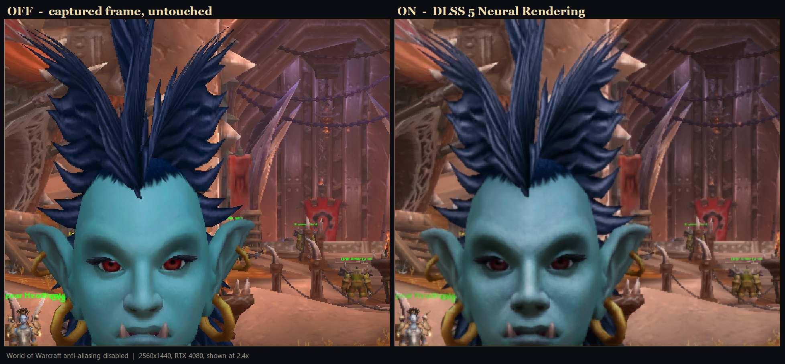
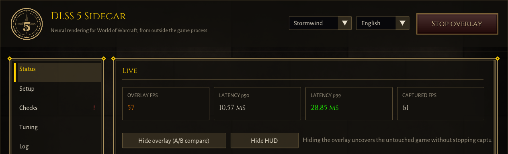
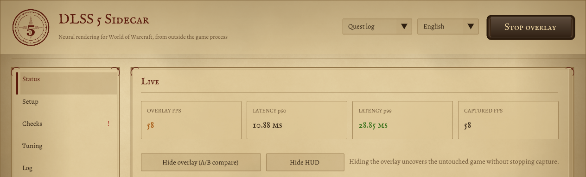
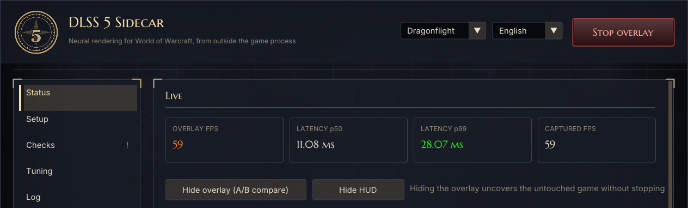

[English](README.md) | **Русский** · [Сайт](https://xilla420.github.io/dlss5-wow-sidecar/) · [История изменений](CHANGELOG.ru.md) · [Как это устроено](docs/HOW-IT-WORKS.ru.md)

# DLSS 5 Sidecar для World of Warcraft

**Нейронный рендеринг NVIDIA DLSS 5 для World of Warcraft — без вмешательства в игру.**
Бесплатный оверлей для видеокарт RTX 40 и RTX 50. В `Wow.exe` ничего не внедряется,
в папку WoW ничего не кладётся.

*Слева — игра как есть. Справа — с DLSS 5. Retail WoW, RTX 4080, 1440p, увеличено в 2,4 раза.*
**[Сравнение «до/после» с ползунком — на сайте →](https://xilla420.github.io/dlss5-wow-sidecar/#compare)**

---

## Как начать

1. **[Скачайте последний выпуск](https://github.com/xilla420/dlss5-wow-sidecar/releases/latest)** и распакуйте куда угодно, *кроме* папки WoW.
2. Запустите **`wowsidecar-manager.exe`**.
3. Запустите WoW в режиме **окна без рамки**.
4. Нажмите **«Запустить оверлей»** (или **Ctrl+Alt+S**) — и просто играйте.

Всё нужное уже в архиве. Страница **«Проверки»** скажет, если что-то не так, и как это исправить.

**Нужно:** Windows 11 · NVIDIA **RTX 40** или **RTX 50** · WoW в окне без рамки.

## Горячие клавиши

В боковой панели доступны **простой** и **расширенный** режимы. Простой режим
оставляет основные настройки; расширенный открывает отдельные параметры,
горячие клавиши, диагностику и журнал. Переключение сохраняет ваши значения.
Кнопки сохранения и отмены изменений всегда доступны внизу окна. Изменения
рендеринга применяются после перезапуска оверлея.

| Клавиши | Что делает |
|---|---|
| **Ctrl+Alt+S** | Запустить или остановить оверлей |
| **Ctrl+Alt+D** | Показать или скрыть оверлей — мгновенное «до/после» |
| **Ctrl+Alt+H** | Показать или скрыть HUD времени кадра |
| **Ctrl+Alt+Backspace** | Аварийная кнопка: снять оверлей в любой ситуации |

Первые три можно изменить на странице **«Настройка»**.

## Сила: 1×, 2× или 3×

DLSS 5 может проходить по каждому кадру несколько раз. **1×** — едва заметно и ближе
всего к игре. **2×** и **3×** уводят картинку дальше — к сильно обработанному виду из
демонстрационных роликов. Каждый дополнительный проход стоит ещё примерно одного прохода времени GPU.

## Три оформления, десять языков

| Штормград | Журнал заданий | Dragonflight |
|---|---|---|
|  |  |  |

Оформление и язык выбираются вверху окна: English, Русский, Español, Deutsch,
Français, Türkçe, العربية, 简体中文, 日本語, 한국어.

## Это безопасно для аккаунта?

Вот чего программа *не делает* — и каждая сборка проверяет это автоматически:

- не загружает код в `Wow.exe` и не читает и не пишет память игры;
- ничего не кладёт в папку WoW и отказывается работать, если найдёт там инжектор;
- никакого ReShade рядом с игрой — именно за это Blizzard банит;
- никаких перехватов клавиатуры, поддельного ввода и выхода в интернет.

Она берёт готовую картинку у Windows — так же, как OBS или демонстрация экрана в
Discord. **Ни одна сторонняя программа не может обещать, что вас никогда не забанят.**
Эта просто не делает ничего из того, за что банят. [Как это проверяется →](docs/HOW-IT-WORKS.ru.md)

## Полезно знать

- **FPS не вырастет.** Нейронный рендеринг DLSS 5 меняет *вид* игры; это не
  апскейлинг и не генерация кадров, и он стоит времени GPU.
- **Windows ограничивает оверлей частотой захвата** — часто 60 кадров. Страница
  «Состояние» показывает, куда уходит каждая миллисекунда.
- **Ограничьте FPS в WoW** (Max Foreground FPS) примерно до частоты захвата — это
  бесплатно освобождает GPU для нейронного прохода.
- **Мало видеопамяти?** Закройте браузеры и программы для стриминга или снизьте
  качество текстур. Программа предупредит об этом.
- Задержка — около 11 мс: для заданий и рейдов нормально, в серьёзном PvP может ощущаться.

## Вопросы

**Работает с WoW Classic?** Да — подходит любой клиент в окне без рамки.

**Это аддон?** Нет. Это отдельная программа Windows поверх окна игры.

**Какие видеокарты?** GeForce RTX 40 и RTX 50. Старые карты, AMD и Intel не поддерживают DLSS 5.

**Где технические подробности?** В разделе [Как это устроено](docs/HOW-IT-WORKS.ru.md).

---

Лицензия MIT. Сторонние компоненты в архиве принадлежат их авторам — см.
[THIRD-PARTY-NOTICES.md](THIRD-PARTY-NOTICES.md). Проект не связан с NVIDIA и Blizzard Entertainment.
